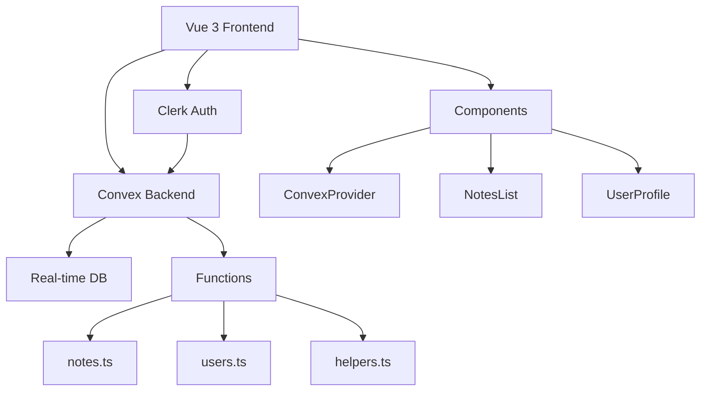

# 🚀 Vue + Convex + Clerk Starter Template

> **Complete full-stack starter** with local Convex development, CRUD operations, and production-ready architecture. Goes beyond basic auth to provide a real working application.

## 🎯 **What Makes This Different**

Built upon [Aaron Saunders' vue-convex-clerk-auth](https://github.com/aaronksaunders/vue-convex-clerk-auth), this template adds:

### ✨ **Key Improvements Over Basic Auth Templates**
- **🏠 Local Development Setup**: Complete Convex local development workflow (not just cloud)
- **📝 Full CRUD Application**: Working notes app with create, read, update, delete operations
- **🏗️ Production Architecture**: DRY principles, helper functions, proper error handling
- **🛡️ Enterprise Security**: Input validation, user isolation, authentication guards
- **⚡ Performance Optimizations**: Backend filtering, optimized queries, type safety
- **📚 Complete Documentation**: Every aspect documented for real-world usage

*This goes beyond "hello world" auth to give you a **complete foundation** for building real applications.*

[](https://vuejs.org/)
[](https://convex.dev/)
[](https://clerk.com/)
[](https://www.typescriptlang.org/)
[](https://vitejs.dev/)

## ✨ What You Get

### 🏠 **Local Development First**
- **Convex runs locally**: Develop with local Convex server, no cloud deployment needed
- **Instant feedback**: See database changes immediately across browser tabs  
- **Offline database**: All CRUD operations work locally (auth still requires internet)
- **Debug-friendly**: Full logging and error handling for development

### 📝 **Real CRUD Application** 
- **Notes Management**: Create, read, update, delete operations
- **User Isolation**: Each user sees only their own notes
- **Billing Features**: Track billable hours and status
- **Advanced Filtering**: Backend-powered search and filtering

### 🛡️ **Enterprise-Grade Security**
- **Authentication Guards**: Every query requires authentication
- **Input Validation**: Comprehensive server-side validation  
- **Error Handling**: Graceful error states with retry functionality
- **User Authorization**: Proper ownership checks on all operations

### ⚡ **Performance & Architecture**
- **DRY Principles**: Helper functions eliminate code duplication
- **Backend Filtering**: Optimized queries with proper indexing
- **TypeScript**: Fully typed with auto-generated API types
- **Future-Proof**: Ready for optimistic updates and advanced features

## 🏗️ Architecture



## 🚀 Quick Start

### 1. **Clone & Install**
```bash
git clone https://github.com/daisys-cloud/vue-convex-clerk-starter.git
cd vue-convex-clerk-starter
npm install
```

### 2. **Setup Environment**
```bash
cp .env.example .env
# Edit .env with your keys (see setup guide below)
```

### 3. **Run Development** 
```bash
# Terminal 1: Start Convex backend LOCALLY
npx convex dev

# Terminal 2: Start Vue frontend  
npm run dev
```

→ **App running at `http://localhost:5173`** 🎉  
→ **Convex dashboard at `http://localhost:3210`** 🎯

**✨ Convex database runs locally - only authentication requires internet connection!**

## 🔧 Complete Setup Guide

### **Step 1: Clerk Authentication Setup**

1. **Create Clerk App**: Go to [clerk.com](https://clerk.com) → Create Application
2. **Configure JWT Template**:
   - Dashboard → JWT Templates → Create Template
   - Choose **Convex** from presets
   - Template Name: `convex`
   - Save template
3. **Get Keys**: Copy the **Publishable Key** (we'll add it to `.env` in Step 3)

### **Step 2: Convex Local Development Setup**

**🏠 This template is designed for LOCAL development first!**

1. **Initialize Convex**:
   ```bash
   npx convex dev  # Creates local development environment
   ```
   
2. **What happens**:
   - Creates `.convex/` folder with local database
   - Starts local Convex server at `http://localhost:3210`
   - Generates API types in `convex/_generated/`
   - **Local database + cloud authentication = best of both worlds!**

3. **Optional: Cloud Setup** (only needed for production):
   - Create project at [convex.dev](https://convex.dev) 
   - Configure Clerk authentication in cloud dashboard
   - Deploy with `npx convex deploy`

### **Step 3: Environment Variables**

1. **Create `.env` file** in your project root:
   ```bash
   cp .env.example .env
   ```

2. **Add your keys** to the `.env` file:
   ```env
   # Convex (will be set automatically by 'npx convex dev')
   VITE_CONVEX_URL=https://your-deployment-123.convex.cloud

   # Clerk (add your key from Step 1)  
   VITE_CLERK_PUBLISHABLE_KEY=pk_test_abc123...

   # Deployment (optional - only needed for production)
   CONVEX_DEPLOY_KEY=your-deploy-key
   ```

**Note**: The `VITE_CONVEX_URL` will be automatically set when you run `npx convex dev`

## 📁 Project Structure

```
├── convex/                 # Convex Backend
│   ├── _generated/        # Auto-generated types
│   ├── helpers.ts         # Auth & utility functions  
│   ├── notes.ts          # Notes CRUD operations
│   ├── users.ts          # User management
│   ├── schema.ts         # Database schema
│   └── auth.config.js    # Clerk integration
├── src/
│   ├── components/       
│   │   ├── ConvexProvider.vue  # Auth wrapper
│   │   ├── NotesList.vue       # Notes management
│   │   ├── NotesForm.vue       # Create/edit notes
│   │   ├── UserProfile.vue     # User info display  
│   │   └── LoadingSpinner.vue  # UI components
│   ├── App.vue           # Main app component
│   └── main.ts          # App entry point
└── package.json         # Dependencies
```

## 🛡️ Security & Best Practices

### ✅ What's Implemented
- **Authentication Guards**: All queries require authentication
- **User Isolation**: Users can only access their own data  
- **Input Validation**: Comprehensive server-side validation
- **Error Handling**: Graceful error states with retry functionality
- **Type Safety**: Full TypeScript coverage with auto-generated types
- **DRY Architecture**: Helper functions eliminate code duplication

### 🔒 Security Features
```typescript
// All mutations use helper functions for consistent auth
const { user } = await requireUser(ctx);

// Input validation & sanitization
if (title.length === 0 || title.length > 200) {
  throw new ConvexError("Title must be between 1 and 200 characters");
}

// User isolation - users can only access their own notes
if (note.createdBy !== user._id) {
  throw new ConvexError("Not authorized");
}
```

## 📊 Database Schema

```typescript
// Users table
users: {
  clerkId: v.string(),      // Clerk user ID
  email: v.string(),        // User email
  name: v.string(),         // Display name  
  createdAt: v.number(),    // Timestamp
}

// Notes table (example feature)
notes: {
  title: v.string(),        // Note title
  content: v.string(),      // Note content
  createdBy: v.id("users"), // User reference
  billable: v.boolean(),    // Billing flag
  duration: v.optional(v.number()), // Time tracking
  billStatus: v.union(      // Billing status
    v.literal("open"),
    v.literal("billed"), 
    v.literal("canceled")
  ),
  createdAt: v.number(),
}
```

## 🎯 Key Features

### **Real-time Everything**
- Live data sync across all connected clients
- Automatic UI updates when data changes
- No manual refresh needed

### **Smart Filtering** 
```typescript
// Backend filtering for performance
const notes = await getNotes({ 
  filters: { 
    createdByCurrentUser: true,
    billStatus: "open" 
  }
});
```

### **Future-Proof Architecture**
- Extensible filter system
- Ready for optimistic updates (when convex-vue supports it)
- Modular component structure

## 🚀 Available Scripts

```bash
npm run dev          # Development server + HMR
npm run build        # Production build
npm run preview      # Preview production build  
npm run type-check   # TypeScript type checking
npx convex dev       # Start Convex backend
npx convex deploy    # Deploy to production
```

## 🌟 Why This Template Exists

### **The Problem with Most Starter Templates**
- 😵 Only show basic authentication ("Hello World" level)
- ☁️ Require full cloud deployment for development  
- 🚫 No real CRUD operations or data management
- 📝 Limited documentation for production use

### **Our Solution: Hybrid Development**
This template evolved from **real-world development challenges**:

- **🏠 Local Database**: Convex runs locally for fast development (auth via Clerk cloud)
- **📱 Real Application Logic**: Complete notes app with advanced features
- **🛡️ Production Security**: Enterprise-grade validation and error handling
- **📚 Battle-Tested**: Optimized through actual development cycles
- **🎯 Developer Experience**: Clear docs, helpful errors, great TypeScript support

**Credits**: Built upon the excellent foundation from [Aaron Saunders' vue-convex-clerk-auth](https://github.com/aaronksaunders/vue-convex-clerk-auth), taking it from auth-only to a complete production-ready starter.

**Author**: Developed and architected by [Martin Ess](https://github.com/daisys-cloud) with focus on local development workflow and enterprise-grade code quality.

## 📚 Learn More

- **[Vue 3 Guide](https://vuejs.org/guide/)** - Frontend framework
- **[Convex Docs](https://docs.convex.dev/)** - Backend platform  
- **[Clerk Docs](https://clerk.com/docs)** - Authentication service
- **[TypeScript Handbook](https://www.typescriptlang.org/docs/)** - Type system

## 🤝 Contributing

Found a bug or want to add a feature? 

1. Fork the repository
2. Create a feature branch: `git checkout -b amazing-feature`
3. Make your changes with tests
4. Submit a pull request

## 📄 License

MIT License - feel free to use this in your projects!

## 🆘 Need Help?

1. **Check the Issues**: [GitHub Issues](https://github.com/daisys-cloud/vue-convex-clerk-starter/issues)
2. **Convex Discord**: [convex.dev/community](https://convex.dev/community)  
3. **Clerk Discord**: [clerk.com/discord](https://clerk.com/discord)

---

**⭐ If this template helped you, please star the repository!**

*Built with ❤️ to help developers ship faster*