# Authentication Flow Diagram

## System Architecture Overview

This document provides a detailed swim lane diagram showing the complete authentication flow between Vue frontend, Clerk authentication service, and Convex backend.

## Swim Lane Diagram

```mermaid
sequenceDiagram
    participant User as 👤 User
    participant Vue as 🟢 Vue Frontend
    participant Clerk as 🔐 Clerk Auth
    participant Convex as 🗄️ Convex Backend
    participant DB as 💾 Database

    Note over User,DB: Page Load / Initial Authentication Flow
    
    User->>Vue: Visit application
    Vue->>Vue: Show "Initializing..." loading state
    Vue->>Clerk: Check authentication status
    Clerk->>Clerk: Determine user session
    Clerk->>Vue: Return auth state + isLoaded flag
    
    alt User is authenticated
        Vue->>Vue: Hide loading, show authenticated UI
        Vue->>Convex: Initialize Convex client
        Vue->>Clerk: Request JWT token for Convex
        Clerk->>Vue: Return JWT token
        Vue->>Convex: Set auth token
        Convex->>Convex: Validate JWT token
        Convex->>Vue: Authentication successful
        
        Vue->>Convex: Call getOrCreateUser()
        Convex->>DB: Query users by clerkId
        alt User exists in database
            DB->>Convex: Return existing user
            Convex->>Vue: Return user ID
        else User doesn't exist
            Convex->>DB: Insert new user record
            DB->>Convex: Confirm user creation
            Convex->>Vue: Return new user ID
        end
        
        Vue->>Convex: Call getCurrentUser()
        Convex->>DB: Query user profile
        DB->>Convex: Return user data
        Convex->>Vue: Return user profile
        Vue->>User: Display user profile
        
    else User is not authenticated
        Vue->>Vue: Hide loading, show sign-in UI
        Vue->>User: Display "Please sign in" message
    end

    Note over User,DB: User Authentication Flow
    
    User->>Vue: Click "Sign In"
    Vue->>Clerk: Open authentication modal
    Clerk->>User: Show sign-in options
    User->>Clerk: Complete authentication
    Clerk->>Vue: Authentication successful
    Vue->>Vue: Update user state
    Vue->>Vue: Trigger re-render with authenticated UI
    
    Vue->>Convex: Initialize Convex connection
    Vue->>Clerk: Request JWT token
    Clerk->>Vue: Return JWT token
    Vue->>Convex: Set auth token
    Convex->>Vue: Connection established
    
    Vue->>Convex: Sync user data
    Convex->>DB: Create/update user record
    DB->>Convex: Confirm operation
    Convex->>Vue: User data synced
    
    Vue->>User: Show authenticated content

    Note over User,DB: User Profile Update Flow
    
    User->>Clerk: Update profile in Clerk
    Clerk->>Vue: Profile change detected
    Vue->>Convex: Sync updated profile data
    Convex->>DB: Update user record
    DB->>Convex: Confirm update
    Convex->>Vue: Profile updated
    Vue->>User: Display updated profile

    Note over User,DB: Sign Out Flow
    
    User->>Vue: Click "Sign Out"
    Vue->>Clerk: Request sign out
    Clerk->>Vue: Sign out successful
    Vue->>Vue: Clear user state
    Vue->>Convex: Close connection
    Convex->>Vue: Connection closed
    Vue->>User: Show unauthenticated UI
```



## Component Responsibilities

### 🟢 Vue Frontend
- **App.vue**: Main application container with authentication state management
- **ConvexProvider.vue**: Convex client provider and auth synchronization
- **UserProfile.vue**: User profile display and data management
- **LoadingSpinner.vue**: Reusable loading state component

### 🔐 Clerk Authentication
- **User Management**: Handle sign-in, sign-up, and profile management
- **Session Management**: Maintain user sessions and JWT tokens
- **JWT Issuance**: Generate Convex-specific authentication tokens
- **State Synchronization**: Provide real-time authentication state updates

### 🗄️ Convex Backend
- **Authentication**: Validate Clerk JWT tokens
- **User Management**: CRUD operations for user data
- **Real-time Sync**: Provide live data updates across clients
- **Database Operations**: Handle all data persistence

### 💾 Database
- **User Storage**: Store user profiles and metadata
- **Data Persistence**: Maintain data integrity and relationships
- **Indexing**: Optimize query performance for common operations

## Key Authentication States

### 1. **Initial Load State**
```
User visits app → Loading spinner → Clerk determines auth → UI renders
```

### 2. **Authenticated State**
```
User signed in → Convex connected → Profile loaded → Full app access
```

### 3. **Unauthenticated State**
```
No user session → Sign-in UI → Clerk handles auth → Post-auth flow
```

### 4. **Loading States**
```
- App initialization: "Initializing..."
- Convex connection: "Connecting to database..."
- Profile loading: "Loading profile..."
```

## Error Handling

### **Authentication Errors**
- JWT token validation failures
- Clerk service unavailability
- Network connectivity issues

### **Database Errors**
- User creation failures
- Profile update errors
- Connection timeouts

### **Recovery Mechanisms**
- Automatic retry logic
- User-initiated retry buttons
- Graceful fallback states

## Security Features

### **JWT Token Security**
- Clerk-issued tokens with short expiration
- Convex-side token validation
- Secure token transmission

### **User Isolation**
- Users can only access their own data
- Clerk ID validation on all operations
- Secure database queries

### **Input Validation**
- Server-side validation of all inputs
- Type safety with TypeScript
- Sanitized data storage

## Performance Optimizations

### **Loading State Management**
- Prevents unnecessary API calls during loading
- Efficient state synchronization
- Minimal re-renders

### **Database Optimization**
- Indexed queries for common operations
- Efficient user lookup by Clerk ID
- Optimized data structures

### **Real-time Updates**
- Efficient subscription management
- Minimal data transfer
- Smart caching strategies

## Monitoring and Debugging

### **Authentication Flow Tracking**
- Clerk authentication state monitoring
- Convex connection status tracking
- User session lifecycle logging

### **Error Logging**
- Comprehensive error capture
- User-friendly error messages
- Developer debugging information

### **Performance Metrics**
- Authentication response times
- Database operation performance
- User experience metrics

---

*This diagram shows the complete authentication flow for the Vue + Convex + Clerk authentication system, demonstrating how all components work together to provide a secure, real-time user experience.*
