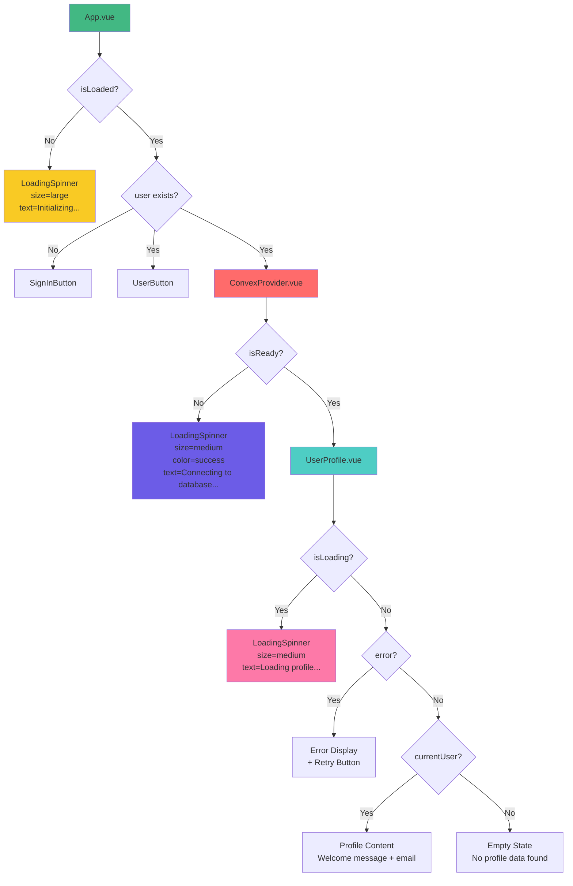
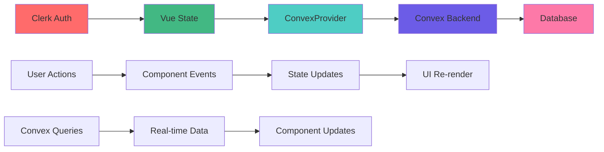

# Component Architecture Diagram

## Vue Component Structure

This document provides a visual representation of how all Vue components are organized and interact within the authentication system.

## Component Hierarchy



## Component Details

### 🟢 **App.vue** - Root Component
- **Purpose**: Main application container and authentication flow controller
- **State Management**: Controls overall app rendering based on Clerk authentication
- **Key Props**: None
- **Key Events**: None
- **Dependencies**: Clerk hooks, LoadingSpinner, ConvexProvider, UserProfile

### 🔴 **ConvexProvider.vue** - Authentication Bridge
- **Purpose**: Manages Convex client authentication and user data synchronization
- **State Management**: Handles Convex connection state and Clerk-Convex sync
- **Key Props**: None (provides context to children)
- **Key Events**: None
- **Dependencies**: Convex client, Clerk hooks, LoadingSpinner

### 🔵 **UserProfile.vue** - User Data Display
- **Purpose**: Displays authenticated user's profile information
- **State Management**: Manages profile loading, error, and display states
- **Key Props**: None
- **Key Events**: Retry button click
- **Dependencies**: Convex queries, LoadingSpinner

### 🟡 **LoadingSpinner.vue** - Reusable Loading Component
- **Purpose**: Provides consistent loading states throughout the application
- **State Management**: None (stateless component)
- **Key Props**: 
  - `size`: "small" | "medium" | "large"
  - `color`: "primary" | "success" | "warning" | "danger"
  - `text`: Loading message
  - `showText`: Boolean to show/hide text
- **Key Events**: None
- **Dependencies**: None

## Data Flow Architecture



## State Management Flow

### **Authentication State**
```
Clerk User State → Vue Reactive State → Component Rendering
```

### **Data Synchronization**
```
Clerk Profile Changes → ConvexProvider → Convex Database → UI Update
```

### **Loading State Management**
```
Component Mount → Loading State → Data Fetch → Content Render
```

## Component Communication

### **Props Down, Events Up Pattern**
- **App.vue** → **ConvexProvider**: Conditional rendering based on auth state
- **ConvexProvider** → **UserProfile**: Provides Convex context
- **UserProfile** → **LoadingSpinner**: Passes loading state props

### **Context Injection**
- **ConvexProvider** provides Convex client context to all children
- **App.vue** provides authentication state context

### **Event Handling**
- **UserProfile** emits retry events for error recovery
- **ConvexProvider** handles authentication state changes

## Responsiveness and Loading States

### **Loading State Hierarchy**
1. **App Level**: Clerk authentication determination
2. **Provider Level**: Convex connection establishment
3. **Component Level**: Data fetching and rendering

### **Loading State Transitions**
```
Initial Load → Clerk Check → Convex Connect → Data Load → Content Display
```

### **Error State Handling**
```
Error Occurred → Error Display → Retry Option → Recovery Attempt
```

## Performance Considerations

### **Lazy Loading**
- Components only render when needed
- Convex connection established on-demand
- User data fetched when authenticated

### **State Optimization**
- Minimal re-renders through reactive state
- Efficient loading state management
- Smart component mounting/unmounting

### **Memory Management**
- Proper cleanup of Convex connections
- Efficient state cleanup on sign out
- Minimal memory footprint

## Accessibility Features

### **Loading Indicators**
- Clear loading messages for each state
- Consistent spinner animations
- Screen reader friendly loading text

### **Error Handling**
- Clear error messages with recovery options
- Retry functionality for failed operations
- Graceful degradation on errors

### **State Announcements**
- Authentication state changes announced
- Loading state transitions communicated
- Error states clearly indicated

---

*This architecture provides a clean, maintainable structure for the authentication system with clear separation of concerns and efficient state management.*

